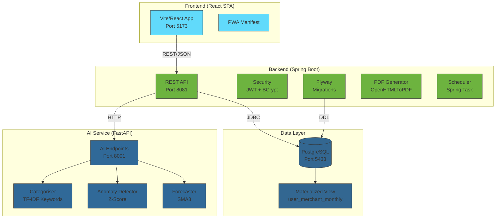
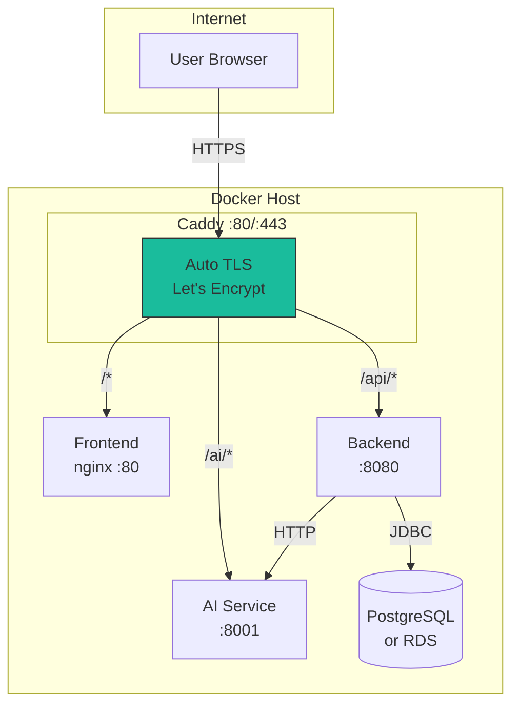
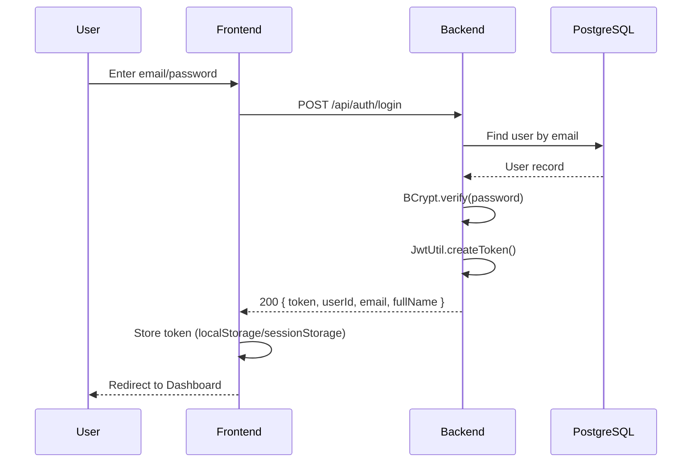
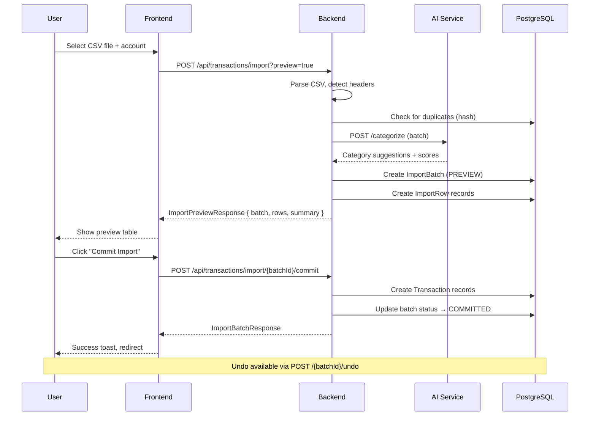
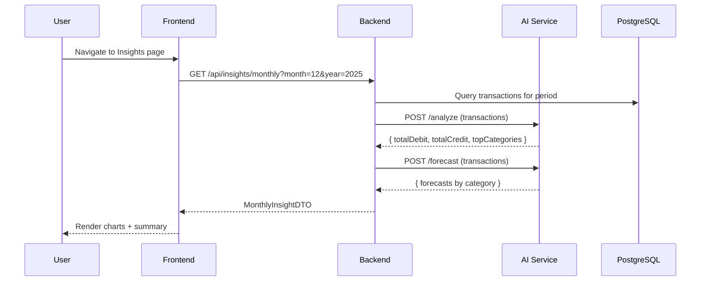
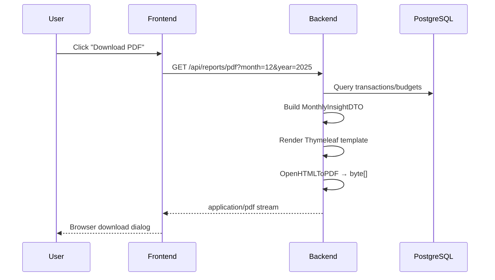

# FinSmart Architecture

> **Generated:** 2025-12-29  
> **Status:** Sprint-1 In Progress

## Executive Summary

FinSmart is a personal finance management application designed to help users track
transactions, manage budgets, and gain insights into spending patterns. The system
follows a three-tier architecture with a React SPA frontend, Spring Boot REST backend,
and a Python-based AI microservice for analytics.

The platform supports CSV transaction imports with duplicate detection, AI-powered
category suggestions, anomaly detection in spending, budget management with rollover
capability, and PDF report generation. The application is designed for local
development with Docker Compose and future production deployment behind Caddy as a
reverse proxy with automatic TLS.

---

## Views

### Component Diagram



### Deployment View

#### Local Development (3 Processes)

```
┌─────────────────────────────────────────────────────────────────┐
│  Local Machine                                                  │
│                                                                 │
│  ┌────────────┐   ┌─────────────────┐   ┌─────────────────┐     │
│  │ Frontend   │   │ Backend         │   │ AI Service      │     │
│  │ Vite Dev   │   │ Spring Boot     │   │ FastAPI/Uvicorn │     │
│  │ :5173      │   │ :8081           │   │ :8001           │     │
│  └─────┬──────┘   └────────┬────────┘   └────────┬────────┘     │
│        │                   │                      │             │
│        │                   │   HTTP               │             │
│        │                   ├──────────────────────┘             │
│        │                   │                                    │
│        │                   ▼                                    │
│        │           ┌─────────────────┐                          │
│        │           │ PostgreSQL      │                          │
│        │           │ (Docker) :5433  │                          │
│        │           └─────────────────┘                          │
│        │                                                        │
└────────┼────────────────────────────────────────────────────────┘
         │
         ▼
    Browser :5173
```

| Service   | Port | Tech Stack                | Env File           |
|-----------|------|---------------------------|--------------------|
| Frontend  | 5173 | Vite 6, React 18, TS      | `.env.local`       |
| Backend   | 8081 | Spring Boot 3.4, Java 17  | `application.yml`  |
| AI        | 8001 | FastAPI, Python 3.12      | inline / `.env`    |
| Database  | 5433 | PostgreSQL 16             | docker-compose.yml |

#### Production (Future – Docker Compose)



| Service  | Image                     | Internal Port | Volume                |
|----------|---------------------------|---------------|------------------------|
| caddy    | caddy:2.8-alpine          | 80, 443       | caddy-data, caddy-config |
| frontend | finsmart/frontend:latest  | 80            | —                      |
| backend  | finsmart/backend:latest   | 8080          | —                      |
| ai       | finsmart/ai:latest        | 8001          | —                      |
| db       | postgres:16 (or RDS)      | 5432          | postgres-data          |

---

### Request Flow Diagrams

#### Login Flow



#### CSV Import v2 (Preview → Commit)



#### Monthly Insights



#### PDF Export



---

## Feature Flags

Feature flags are configured via environment variables and read by both frontend
and backend.

### Frontend (VITE_FEATURE_*)

| Flag                       | Default | Purpose                           |
|----------------------------|---------|-----------------------------------|
| `VITE_FEATURE_DEMO`        | false   | Enable demo/onboarding wizard     |
| `VITE_FEATURE_CSV_IMPORT_V2` | false | Enhanced CSV import UI            |
| `VITE_FEATURE_BUDGET_ROLLOVER` | false | Budget rollover functionality   |
| `VITE_FEATURE_ENVELOPE`    | false   | Envelope budgeting view           |
| `VITE_FEATURE_INSIGHTS_V2` | false   | Merchant insights + anomaly inbox |
| `VITE_FEATURE_PWA`         | false   | PWA installation prompt           |
| `VITE_FEATURE_EXPORT_CENTRE` | false | Export centre UI                  |
| `VITE_FEATURE_OB_OB_READONLY` | false | Open Banking stub (read-only)   |

### Backend

| Property                   | Default | Purpose                           |
|----------------------------|---------|-----------------------------------|
| `APP_FEATURE_DEMO_DATA`    | false   | Enable `/api/admin/demo/*`        |
| (via user_feature_flags)   | —       | Per-user flag overrides in DB     |

---

## Security

### Authentication & Authorisation

| Aspect           | Implementation                                      |
|------------------|-----------------------------------------------------|
| Password Storage | BCrypt (Spring Security default)                    |
| Session          | Stateless (JWT in `Authorization: Bearer` header)   |
| JWT Library      | io.jsonwebtoken:jjwt (HMAC-SHA256)                  |
| Token Expiry     | Configurable (`APP_JWT_EXPIRES_MINUTES`, default 60)|
| Token Claims     | `sub` = email, `userId` = UUID, `iss`, `iat`, `exp` |

### CORS

Configured in `SecurityConfig.java`:
- Allowed origins: `localhost:5173`, `localhost:5174`, `localhost:5175`, `localhost:3000`
- Allowed methods: GET, POST, PUT, DELETE, OPTIONS
- Credentials: true

### Security Headers

| Header                  | Value                                |
|-------------------------|--------------------------------------|
| X-Frame-Options         | DENY                                 |
| X-Content-Type-Options  | nosniff                              |
| X-XSS-Protection        | 1; mode=block                        |
| Referrer-Policy         | no-referrer                          |
| Content-Security-Policy | default-src 'self'                   |

### Rate Limiting

Implemented via `RateLimitFilter` using Bucket4j:
- Login endpoint: 10 requests/minute per IP
- General API: 100 requests/minute per IP
- Response: HTTP 429 with JSON error body

### Audit Logging

`AuditLoggingFilter` logs all HTTP requests to `audit_events` table:
- user_email, method, path, status, IP, user-agent, timestamp
- Async persistence to avoid request latency

---

## Non-Functional Aspects

### Validation

- Jakarta Validation annotations on DTOs and entities
- `@Valid` on controller method parameters
- Custom validators where needed (e.g., month 1-12)

### Pagination

Default pagination via Spring Data:
- Default page size: 20
- Default sort: `postedAt` (transactions)
- Response wrapper: `PageResponse<T>` with content, page, size, totalElements, totalPages

### Logging

- Backend: SLF4J + Logback, structured via Zalando Logbook
- AI: Python `logging` module
- Logbook excludes `/actuator/**` and obfuscates `Authorization`, `password`, `token`

### Error Envelope

Standard error response format:

```json
{
  "timestamp": "2025-12-29T10:30:00Z",
  "status": 400,
  "error": "Bad Request",
  "message": "Validation failed for field 'email'",
  "path": "/api/auth/register"
}
```

---

## Assumptions & Risks

### Assumptions

1. PostgreSQL 16+ is available (local Docker or managed)
2. Java 17+ and Node 18+ installed for local development
3. Python 3.12+ for AI service
4. Users access via modern browsers (ES2020+ support)

### Risks

| Risk                              | Impact | Mitigation                        |
|-----------------------------------|--------|-----------------------------------|
| AI service unavailable            | Medium | Fallback to "Uncategorized"       |
| JWT secret leaked                 | High   | Rotate secret, invalidate tokens  |
| Rate limit bypass via IP spoofing | Low    | Add fingerprinting in prod        |
| Large CSV imports timeout         | Medium | Chunked processing (future)       |
| No backup strategy defined        | High   | Implement pg_dump schedule        |

---

## Related Documents

- [API.md](./API.md) – REST endpoint reference
- [DATA_MODEL.md](./DATA_MODEL.md) – Database schema and migrations
- [FRONTEND_MAP.md](./FRONTEND_MAP.md) – UI routes and components
- [AI_SPEC.md](./AI_SPEC.md) – AI service specification
- [DEPLOY_PLAN.md](./DEPLOY_PLAN.md) – Deployment guide
- [SPRINT1_STATUS.md](./SPRINT1_STATUS.md) – Sprint-1 checklist
