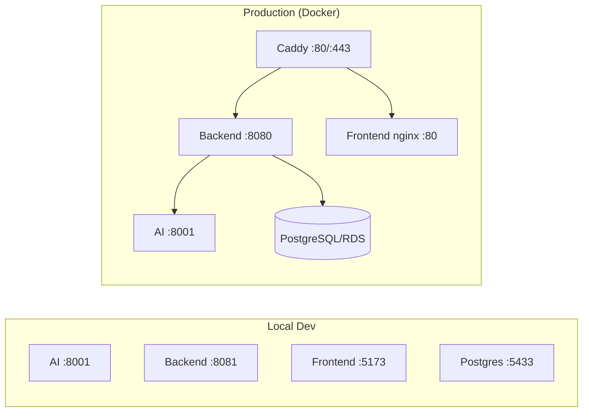
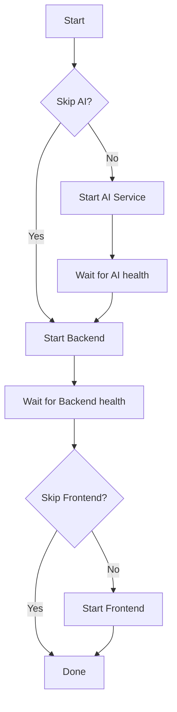
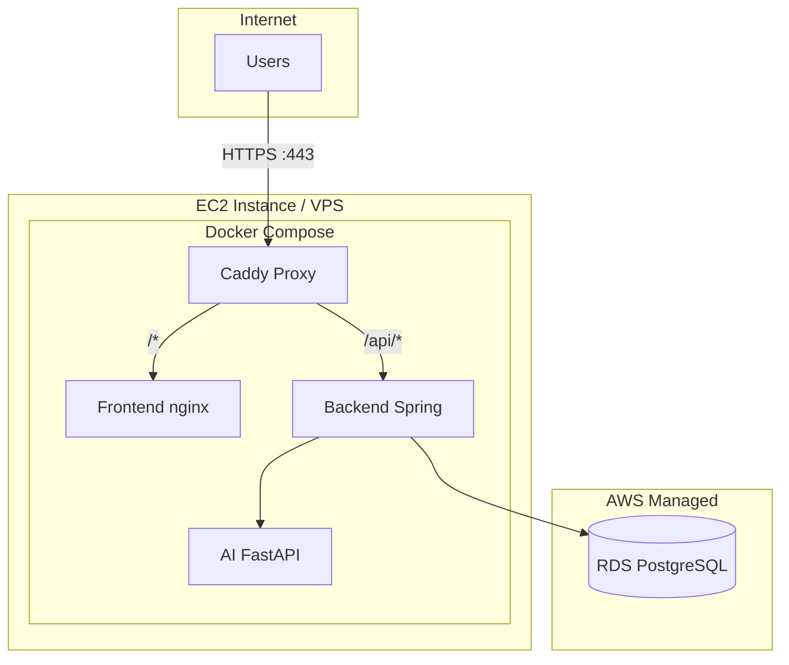

# FinSmart Deployment Plan

> **Generated:** 2025-12-29

## Overview

FinSmart runs as three interconnected services plus a reverse proxy:



---

## Local Development Setup

### Prerequisites

| Tool              | Version   | Purpose                       |
|-------------------|-----------|-------------------------------|
| Node.js           | 18+       | Frontend build                |
| Java              | 17+       | Backend (Spring Boot)         |
| Python            | 3.10+     | AI service                    |
| Docker Desktop    | Latest    | PostgreSQL container          |
| PowerShell        | 5.1+      | Orchestration scripts         |

### Quick Start

```powershell
# Clone and enter repo
git clone https://github.com/your-org/finsmart.git
cd finsmart

# Start database (Docker)
docker compose up -d db

# Run all services (in separate windows)
.\scripts\run_all.ps1
```

### Service URLs (Local)

| Service   | URL                         | Port  |
|-----------|-----------------------------|-------|
| Frontend  | http://localhost:5173       | 5173  |
| Backend   | http://localhost:8081/api   | 8081  |
| AI        | http://localhost:8001       | 8001  |
| Postgres  | localhost (Docker)          | 5433  |

### run_all.ps1 Workflow

The orchestration script starts services in dependency order:



**Parameters:**
- `-SkipAI` — Start only Backend + Frontend
- `-SkipFrontend` — Start only AI + Backend

### Individual Service Commands

```powershell
# AI Service
cd ai
pip install -r requirements.txt
uvicorn app.main:app --host 0.0.0.0 --port 8001 --reload

# Backend
cd backend
./mvnw spring-boot:run

# Frontend
cd frontend
npm install
npm run dev
```

---

## Docker Compose (Local)

For full containerised local development:

```bash
# Start all services
docker compose up -d

# View logs
docker compose logs -f

# Stop all
docker compose down
```

### docker-compose.yml Services

| Service   | Image               | Port Mapping | Depends On |
|-----------|---------------------|--------------|------------|
| db        | postgres:16-alpine  | 5433:5432    | —          |
| ai        | ./ai Dockerfile     | (internal)   | —          |
| backend   | ./backend Dockerfile| 8081:8080    | db, ai     |
| frontend  | ./frontend Dockerfile| 5173:80     | backend    |

### Environment Variables (Local)

Create `.env` at repo root:

```env
# Database
DB_URL=jdbc:postgresql://db:5432/finsmartdb
DB_USER=finsmart
DB_PASSWORD=localdevpassword

# JWT
APP_JWT_SECRET=dev-secret-at-least-256-bits-long-string-here
APP_JWT_ISSUER=finsmart
APP_JWT_EXPIRES_MINUTES=60

# AI Service
AI_URL=http://ai:8001

# Frontend CORS
APP_FRONTEND_URL=http://localhost:5173
```

---

## Production Deployment

### Architecture



### docker-compose.prod.yml

**Services:**

| Service  | Container Name    | Restart Policy | Health Check                    |
|----------|-------------------|----------------|---------------------------------|
| ai       | finsmart-ai       | unless-stopped | curl http://localhost:8001/health |
| backend  | finsmart-backend  | unless-stopped | curl http://localhost:8080/api/health |
| frontend | finsmart-frontend | unless-stopped | wget http://localhost:80/health  |
| caddy    | finsmart-caddy    | unless-stopped | wget http://localhost:80/health  |

### Caddy Reverse Proxy

Caddy handles:
- Automatic TLS via Let's Encrypt
- HTTP/2 and HTTP/3
- Reverse proxy routing

**Caddyfile:**

```caddyfile
{$DOMAIN} {
    # API routes → Backend
    handle /api/* {
        reverse_proxy backend:8080
    }
    
    # Static files → Frontend
    handle {
        reverse_proxy frontend:80
    }
    
    # Security headers
    header {
        X-Frame-Options DENY
        X-Content-Type-Options nosniff
        Strict-Transport-Security "max-age=31536000; includeSubDomains"
    }
}
```

### Production Environment Variables

Create `.env.production`:

```env
# Domain
DOMAIN=finsmart.yourdomain.com
APP_FRONTEND_URL=https://finsmart.yourdomain.com

# Database (RDS)
DB_URL=jdbc:postgresql://your-rds.amazonaws.com:5432/finsmartdb
DB_USER=finsmart
DB_PASSWORD=<strong-password-from-secrets-manager>

# JWT (use strong secret!)
APP_JWT_SECRET=<256-bit-secure-random-string>
APP_JWT_ISSUER=finsmart
APP_JWT_EXPIRES_MINUTES=60

# Internal
AI_URL=http://ai:8001

# JVM
JAVA_OPTS=-Xms256m -Xmx512m
```

### Deployment Commands

```bash
# SSH to production server
ssh ubuntu@your-server.com

# Pull latest code
cd /opt/finsmart
git pull origin main

# Deploy with production compose
docker compose -f docker-compose.prod.yml up -d --build

# Check status
docker compose -f docker-compose.prod.yml ps
docker compose -f docker-compose.prod.yml logs -f
```

---

## CI/CD Pipeline

### Current Status

⚠️ **GitHub Actions workflows are NOT yet implemented.**

The `.github/workflows` folder is empty. See [GITHUB_ACTIONS_SETUP.md](./GITHUB_ACTIONS_SETUP.md) for planned configuration.

### Planned Workflows

| Workflow   | Trigger                  | Actions                                |
|------------|--------------------------|----------------------------------------|
| `ci.yml`   | Push, PR to main         | Build, test, lint all services         |
| `deploy.yml` | Tag push `v*`, manual  | Build Docker images, push to registry, SSH deploy |

### Required GitHub Secrets

| Secret               | Description                              |
|----------------------|------------------------------------------|
| `DOCKERHUB_USERNAME` | Docker Hub username                      |
| `DOCKERHUB_TOKEN`    | Docker Hub access token                  |
| `PROD_SSH_HOST`      | EC2/VPS hostname or IP                   |
| `PROD_SSH_USER`      | SSH username (e.g., `ubuntu`)            |
| `PROD_SSH_KEY`       | Private SSH key (full content)           |
| `PROD_SSH_PORT`      | SSH port (default 22)                    |
| `PROD_DOMAIN`        | Production domain name                   |

### Recommended CI Steps

```yaml
# ci.yml (example)
jobs:
  backend:
    runs-on: ubuntu-latest
    steps:
      - uses: actions/checkout@v4
      - uses: actions/setup-java@v4
        with:
          java-version: '17'
          distribution: 'temurin'
      - run: cd backend && ./mvnw verify -B

  frontend:
    runs-on: ubuntu-latest
    steps:
      - uses: actions/checkout@v4
      - uses: actions/setup-node@v4
        with:
          node-version: '18'
      - run: cd frontend && npm ci && npm run lint && npm run build

  ai:
    runs-on: ubuntu-latest
    steps:
      - uses: actions/checkout@v4
      - uses: actions/setup-python@v5
        with:
          python-version: '3.12'
      - run: cd ai && pip install -r requirements.txt && pytest
```

---

## Secrets Management

### Local Development

- Use `.env` file (gitignored)
- Never commit secrets to repository
- Use placeholder values in example files

### Production

| Method               | Recommendation                           |
|----------------------|------------------------------------------|
| AWS Secrets Manager  | ✅ Best for RDS credentials, JWT secret  |
| GitHub Secrets       | ✅ For CI/CD variables                   |
| Docker Secrets       | ✅ If using Docker Swarm                 |
| `.env.production`    | ⚠️ Only on server, chmod 600             |

### Secret Rotation

1. **JWT Secret** — Rotate quarterly; redeploy backend
2. **DB Password** — Rotate via AWS Secrets Manager
3. **Docker Hub Token** — Rotate annually

---

## Ports Summary

### Local Development

| Port | Service   | Protocol |
|------|-----------|----------|
| 5173 | Frontend  | HTTP     |
| 8081 | Backend   | HTTP     |
| 8001 | AI        | HTTP     |
| 5433 | PostgreSQL| TCP      |

### Production (Docker)

| Port | Service | Protocol | Exposed |
|------|---------|----------|---------|
| 80   | Caddy   | HTTP     | ✅      |
| 443  | Caddy   | HTTPS    | ✅      |
| 8080 | Backend | HTTP     | Internal |
| 8001 | AI      | HTTP     | Internal |
| 80   | Frontend| HTTP     | Internal |

---

## Health Check Endpoints

| Service  | Endpoint              | Expected Response         |
|----------|-----------------------|---------------------------|
| Backend  | GET /api/health       | `{"status":"UP"}`         |
| AI       | GET /health           | `{"status":"ai ok"}`      |
| Frontend | GET /health (nginx)   | 200 OK                    |

---

## Troubleshooting

### Database Connection Issues

```powershell
# Check if PostgreSQL is running
docker compose ps db

# Test connection
docker compose exec db psql -U finsmart -d finsmartdb -c "SELECT 1"

# View logs
docker compose logs db
```

### Backend Won't Start

```powershell
# Check environment variables
docker compose exec backend env | grep DB

# View startup logs
docker compose logs backend

# Run locally for detailed errors
cd backend
./mvnw spring-boot:run -Dspring-boot.run.profiles=local
```

### Frontend Build Fails

```powershell
# Clear npm cache
cd frontend
rm -rf node_modules
npm cache clean --force
npm install
npm run build
```

### Caddy Certificate Issues

```bash
# Check Caddy logs
docker compose -f docker-compose.prod.yml logs caddy

# Verify DNS resolution
nslookup your-domain.com

# Test with staging certificates first
# Add to Caddyfile: acme_ca https://acme-staging-v02.api.letsencrypt.org/directory
```

---

## Backup Strategy

### Database Backups

```bash
# Manual backup
docker compose exec db pg_dump -U finsmart finsmartdb > backup_$(date +%Y%m%d).sql

# Restore
docker compose exec -T db psql -U finsmart finsmartdb < backup_20251229.sql
```

### Recommended (Production)

- AWS RDS automated snapshots (daily, 7-day retention)
- Point-in-time recovery enabled
- Cross-region replica for DR

---

## Scaling Considerations

| Service  | Scaling Approach                           |
|----------|-------------------------------------------|
| Frontend | CDN (CloudFront), static hosting (S3)     |
| Backend  | Horizontal (multiple containers, LB)       |
| AI       | Horizontal (stateless, LB-friendly)        |
| Database | Vertical (RDS instance size), read replicas |

---

## Related Documents

- [ARCHITECTURE.md](./ARCHITECTURE.md)
- [GITHUB_ACTIONS_SETUP.md](./GITHUB_ACTIONS_SETUP.md)
- [DOCKER_SETUP_COMPLETE.md](./DOCKER_SETUP_COMPLETE.md)
- [SECURITY_IMPLEMENTATION.md](./SECURITY_IMPLEMENTATION.md)
